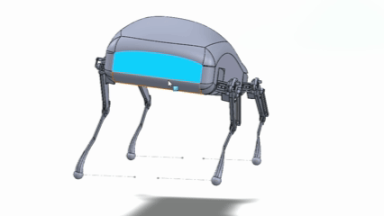
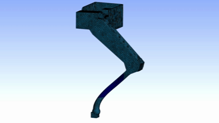

# 4-Legged Robot Dog

Design and analysis of a quadruped robot model using SolidWorks and ANSYS. Focus on CAD design, four-bar kinematic linkages, and static structural analysis under fixed loading.

---

## Overview
- Modeled and assembled a 4-legged robot in **SolidWorks**.  
- Implemented **four-bar linkages** per leg for torque amplification and reduced servo torque requirement.  
- Conducted **static structural analysis** in **ANSYS** to evaluate stress and deformation under load.

---

## Design and Assembly (SolidWorks)
- Modeled all parts from base sketches and assembled using kinematic constraints.  
- Fixed the toe joint; remaining parts moved through four-bar linkages.  
- Managed dependency and feature-tree issues to maintain correct constraint hierarchy.

---

## Structural Analysis (ANSYS)
- Applied **10 kg (≈ 100 N)** load on the hip link.  
- Constrained toe to motion in **XZ-plane**.  
- Resolved meshing failures by fusing critical joints and thickening thin areas.  
- Verified deformation and stress distribution under static loading.

---

## Demonstration

| Kinematic Motion | Static Structural Analysis |
|------------------|----------------------------|
|  |  |

*(Add your recorded simulation or motion study GIFs in the `/media` folder and name them as above.)*

---

## Tools
- **CAD:** SolidWorks  
- **FEA:** ANSYS Workbench (Static Structural)  
- **Concepts:** Four-bar linkage, torque amplification, constraint-based motion  

---

## Author
**Naman Gupta**  
B.Tech – Mechanical Engineering  
[LinkedIn](https://www.linkedin.com/in/naman-gupta-4227/)
